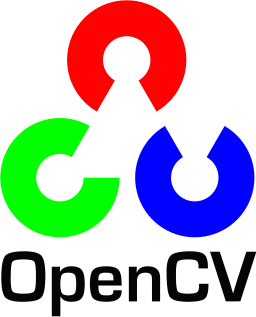

## PROFILE
| key | value |
|---- | ---- |
| Name | Yuuki Shigematsu |
| Job | Second-year master's student |
| Research | summary generation in NLP(Natural Language Processing) |
| SNS | ・Instagram　[@sycareer](https://www.instagram.com/sy.career/) ・LinkedIn   [Yuuki Shigematsu](https://www.linkedin.com/in/yuuki-shigematsu-ab5203223) |

## SUMMARY

## WORK EXPERIENCE
I do not yet have a job history as an engineer.\
I will start in 2023 and will update from there.

## EDUCATION
・KUMAMOTO UNIVERSITY Bachelor of Information Science (April 2018 - March 2021)\
・KUMAMOTO UNIVERSITY Master of Information Science (April 2021 - )

## QUALIFICATIONS/SPECIAL SKILLS
・TOEIC 735 (2021)\
・Bookkeeping Certificate-Nissho 3rd grade (2020)

## ADDITIONAL INFORMATION
・Volunterr　crime-prevention, 2018-2021\

## Languages and Tools

 
 
 

](https://github.com/anuraghazra/github-readme-stats)
